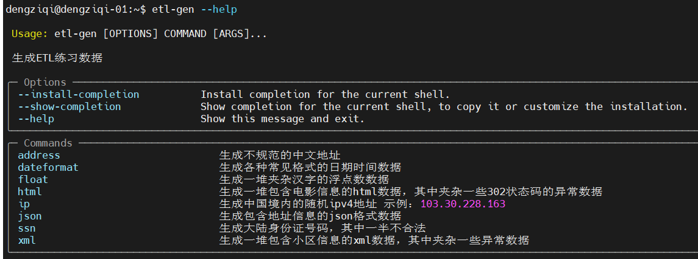
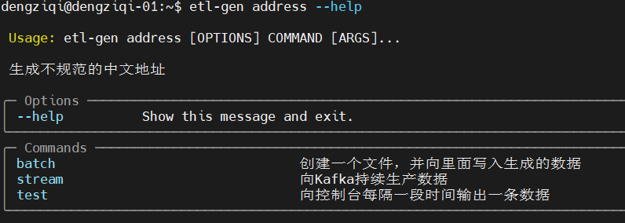
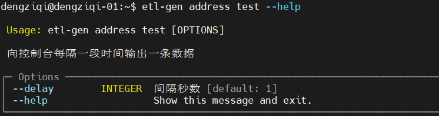
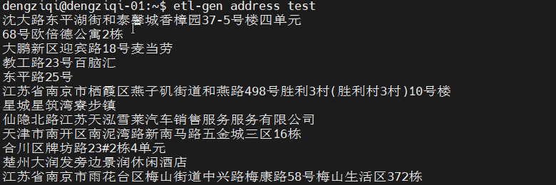

# etl-gen
尚硅谷ETL靶场——生成数据的命令行工具。
## 使用方式
```shell
pip install etl-gen
```
安装后的命令行工具在 `$HOME/.local/bin`路径下。为了方便使用，需要将`$HOME/.local/bin`路径加入到环境变量。

## 子命令
etl-gen目前有8个子命令，分别用来生成8种模拟数据

| 子命令        | 说明                                  |
|------------|-------------------------------------|
| address    | 生成不规范的中文地址                          |
| dateformat | 生成各种常见格式的日期时间格式                     |
| float      | 生成一堆夹杂汉字的浮点数数据                      |
| html       | 生成一堆包含电影信息的html数据，其中加载一些302状态码的异常数据 |
| ip         | 生成中国境内的随机ipv4地址，示例：103.30.228.163   |
| json       | 生成包含地址信息的json格式数据                   |
| ssn        | 生成大陆身份证号码，其中一半不合法                   |
| xml        | 生成一堆包含小区信息的xml数据，其中夹杂一些异常数据         |

上述每个子命令又分别包含3个子命令

| 子命令    | 说明                   |
|--------|----------------------|
| batch  | 创建一个文件，并向这个文件写入生成的数据 |
| stream | 向kafka每隔一段时间生产一条数据   |
| test   | 向控制台每隔一段时间输出一条数据     |

## 示例

### 使用help

不论你处于哪个子命令下，你都可以使用 `--help`寻求帮助。

示例：`etl-gen`命令的帮助信息
```shell
etl-gen --help
```



示例：`etl-gen address`命令的帮助信息
```shell
etl-gen address --help
```



示例：`etl-gen address test`命令的帮助信息

```shell
etl-gen address test --help
```


示例：向控制台输出不规范的中文地址
```shell
etl-gen address test
```
